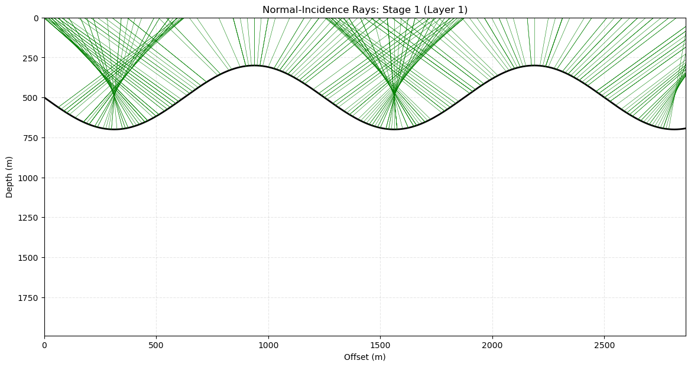
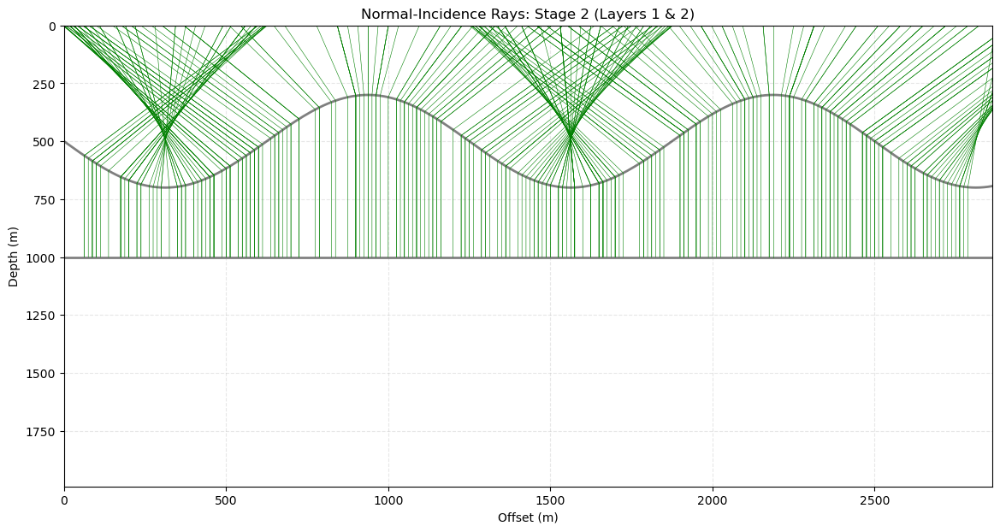

# 2D Seismic Forward Modeling and Post-Stack Time Migration
### Integrated Framework for Structural Imaging and Signal Analysis
**Author:** Mahla Zafaryazdi

This repository provides a high-fidelity numerical simulation of seismic wave propagation and imaging. It implements the full seismic pipeline—from synthetic velocity model building to advanced **Post-Stack Time Migration (PSTM)** and **Kirchhoff Depth Migration (KDM)**—using Python-based computational tools.

---

## 🛑 Problem Statement: The Challenge of Subsurface Imaging

In seismic exploration, raw data recorded at the surface does not provide a true map of the subsurface. The primary challenge, addressed in this project, is **Spatial Aliasing and Diffraction Overlap**.

When a seismic wave hits a complex boundary (folded, dipping, or discontinuous), it creates **Diffraction Hyperbolas**. As shown in the image below (from Chapter 4, Yilmaz), these hyperbolas obscure the true location, dip, and spatial resolution of reflectors, making structural interpretation impossible without advanced processing.

*Figure 1: Exploding reflector model showing diffraction hyperbolas (top) overlapping at the surface (bottom).*

This project focuses on **Migration**: a crucial signal processing technique that collapses these hyperbolas and relocates seismic energy to its true spatial $(x, z)$ origin.

---

## 🎯 Project Objectives

Derived from the methodology presented in my final defense (PowerPoint available in the repo), the goals are:
1. **Geometric Modeling:** Construction of complex interfaces including Sinusoidal (folded), Flat, and Dipping (fault-like) reflectors.
2. **Ray Theory Analysis:** Normal-incidence ray tracing and estimation of reflector normals.
3. **Seismic Synthesis:** Generating unmigrated zero-offset sections using a **60 Hz Ricker Wavelet**.
4. **Advanced Imaging:** Comparative analysis of PSTM (Time-Domain) vs. KDM (Depth-Domain) migration algorithms.

---

## 🧠 Connection to Machine Learning & Geophysics

This framework serves as a robust **Synthetic Data Generator** for modern ML applications in Earth Science:
- **Automatic Picking:** Training architectures like **UNet/CNN** for layered boundary detection.
- **Inversion:** Generating training pairs for Physics-Informed Neural Networks (**PINNs**).

---

## 📊 Results: A Comparative Look

### Time Migration vs. Depth Migration
Migration effectively focuses seismic energy, transforming uninterpretable time sections into a clear structural map. Note the subtle differences in layer positioning between PSTM and KDM, highlighting the importance of proper structural imaging.

| Post-Stack Time Migration (PSTM) | Kirchhoff Depth Migration (KDM) |
| :---: | :---: |
| *Structural positioning in **Seconds*** | *Structural map in **Meters*** |
|  |  |
## 📊 Dynamic Migration Workflow Analysis

The core of this seismic imaging framework is the ability to collapse diffraction energy and relocate reflections to their true spatial coordinates. The animation below demonstrates the step-by-step transition of the seismic data:

1. **Unmigrated Time Section (Raw Data):** Characterized by overlapping diffraction hyperbolas and structural distortions.
2. **Post-Stack Time Migration (PSTM):** Collapses hyperbolas to their apexes, significantly improving lateral resolution in the time domain.
3. **Kirchhoff Depth Migration (KDM):** Converts the time-section into a true structural depth map (meters), providing the final geological interpretation.

*Animation: Transition from raw data (Fig 3) to Time Migration (Fig 4) and Depth Migration (Fig 5).*

## 🖼 Project Workflow & Visual Results

### 1. Model Geometry & Velocity Field
The initial structural model consists of three primary reflectors: Sinusoidal, Flat, and Dipping layers.

### 2. Ray Tracing Analysis
Normal-incidence rays were traced to understand the wave propagation paths.

### 3. Zero-Offset Section (Unmigrated)
The exploding reflector model results in complex diffraction patterns and overlapping energy.

### 4. Migration Results (Time vs. Depth)
Below is the comparison between the processed sections.
| Post-Stack Time Migration (PSTM) | Kirchhoff Depth Migration (KDM) |
| :---: | :---: |
|  |  |
## 💡 Key Insights & Concluding Remarks

Based on the numerical simulations and the final comparative analysis, the following technical conclusions were reached:

* **Diffraction Resolution:** The implementation of the **Exploding Reflector Model** effectively demonstrated the "bow-tie" effect and overlapping diffractions caused by complex subsurface geometries (as seen in the Sinusoidal layer).
* **Time vs. Depth Limitation:** While **Post-Stack Time Migration (PSTM)** successfully collapsed diffraction hyperbolas and improved the structural image, it remains limited to the time domain. For accurate geological mapping, a robust velocity model is required to perform **Depth Migration (KDM)**.
* **Structural Fidelity:** Kirchhoff Migration proved highly effective in attenuating distortions and relocating dipping reflectors to their true spatial positions, which is critical for identifying structural traps.
* **Future Enhancements:** To further improve results, especially in areas with strong lateral velocity variations, implementing **Pre-Stack Migration** and **Velocity Model Iteration** would be the next logical step to achieve a higher-fidelity subsurface image.
---

## 📧 Contact
**Mahla Zafaryazdi** - [Your Email Address] - [Your LinkedIn/Portfolio Link]